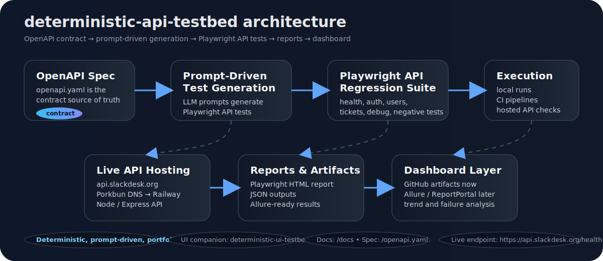

# deterministic-api-testbed


A **deterministic API testbed** for experimenting with modern QA automation techniques including:

- Playwright API testing
- OpenAPI contract-driven testing
- Prompt‑driven test generation
- Deterministic test fixtures
- Hosted test infrastructure

This project provides a **real API environment for automation frameworks** and pairs with the companion project:

```
deterministic-ui-testbed
```

Together they demonstrate a **complete modern QA automation stack**.

---

# 🌐 Live API

Base URL

```
https://api.slackdesk.org
```

Health endpoint

```
https://api.slackdesk.org/health
```

Swagger UI

```
https://api.slackdesk.org/docs
```

OpenAPI spec

```
https://api.slackdesk.org/openapi.yaml
```

---

# 🏗 Architecture

This project uses an OpenAPI contract as the source of truth, generates Playwright API tests from prompts, executes them locally or in CI, and publishes structured results for dashboards.



---

# 📡 API Overview

| Endpoint | Purpose |
|---|---|
| /health | service health |
| /users | list users |
| /users/{id} | fetch user |
| /auth/login | authentication |
| /tickets | issue tracking |
| /debug/echo | request inspection |
| /debug/delay/{ms} | latency testing |
| /debug/error | failure testing |

These endpoints are deterministic and designed for **repeatable automated testing**.

---

# 📁 Project Structure

```
deterministic-api-testbed
│
├─ src
│   └─ server.ts
│
├─ tests
│   └─ api
│       ├─ health.spec.ts
│       ├─ users.spec.ts
│       ├─ auth.spec.ts
│       ├─ tickets.spec.ts
│       └─ debug.spec.ts
│
├─ scripts
│   └─ generate-api-tests.js
│
├─ prompts
│   ├─ api-regression-generator.md
│   ├─ api-negative-tests.md
│   ├─ api-resilience-tests.md
│   └─ api-smoke-generator.md
│
├─ openapi.yaml
├─ playwright.config.ts
└─ package.json
```

---

# ▶ Running the API Locally

Install dependencies

```
npm install
```

Start the server

```
npm run serve
```

Server will run on

```
http://localhost:3001
```

Swagger documentation

```
http://localhost:3001/docs
```

---

# 🧪 Running API Tests

This project uses **Playwright's APIRequestContext** for deterministic API testing.

Run tests

```
npm test
```

Run tests against the hosted API

```
API_BASE_URL=https://api.slackdesk.org npm test
```

Example test

```ts
test("GET /health returns healthy", async ({ request }) => {
  const res = await request.get("/health");

  expect(res.status()).toBe(200);

  const body = await res.json();
  expect(body.ok).toBe(true);
});
```

---

# 🤖 Prompt‑Driven Test Generation

One of the goals of this project is to explore **AI‑assisted QA automation**.

Prompts can generate Playwright API tests using the OpenAPI spec.

Example prompt:

```
Generate Playwright API tests for the API described in openapi.yaml.

Requirements
- TypeScript
- Playwright APIRequestContext
- group tests by endpoint
- include success and invalid request cases
- assert status codes and required fields
```

Generated tests are written to:

```
tests/generated/
```

Run the generator

```
node scripts/generate-api-tests.js
```

---

# 🧰 Debug Endpoints

Echo request

```
GET /debug/echo
```

Latency simulation

```
GET /debug/delay/{ms}
```

Example

```
/debug/delay/1000
```

Server error simulation

```
GET /debug/error
```

These endpoints are useful for testing:

- retries
- timeouts
- error handling
- monitoring systems

---

# 📚 Swagger Documentation

Interactive API documentation

```
https://api.slackdesk.org/docs
```

Raw OpenAPI contract

```
https://api.slackdesk.org/openapi.yaml
```

This enables:

- Postman imports
- contract testing
- automated test generation
- API discovery

---

# 🚀 Future Enhancements

Planned improvements include:

### Test Results Dashboard

- Playwright HTML reports
- Allure reporting
- CI test history
- failure analysis

### Contract Testing

- OpenAPI schema validation
- response contract verification

### Automated Test Generation

- prompt‑driven regression tests
- endpoint coverage analysis

---

# 🔗 Related Project

```
deterministic-ui-testbed
```

Together these repositories demonstrate a **complete automation testing stack**.

```
UI testing
Playwright browser automation

API testing
Playwright APIRequestContext

Contract testing
OpenAPI

Prompt‑driven automation
LLM workflows
```

---

# 📄 License

MIT
